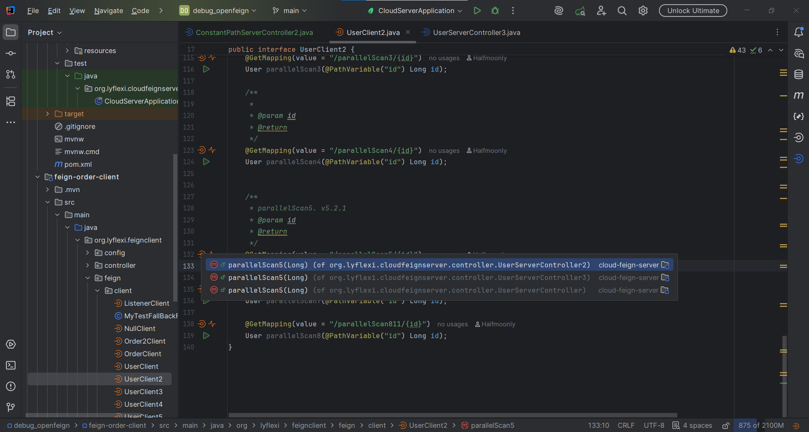
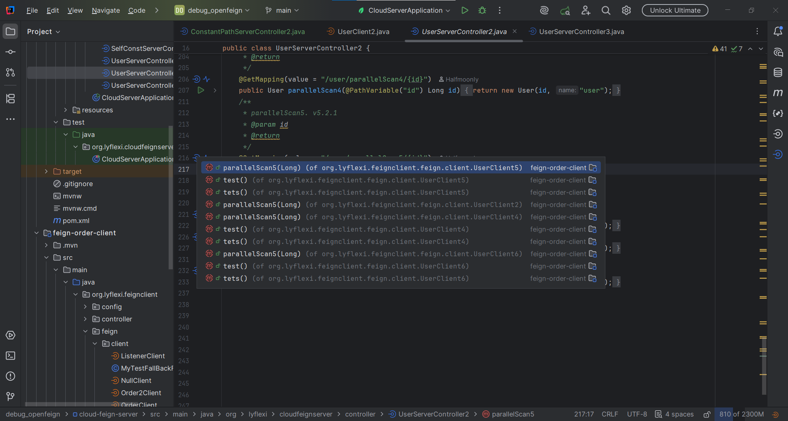
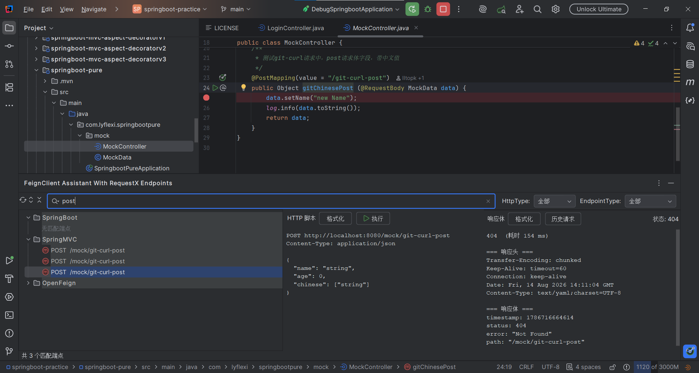
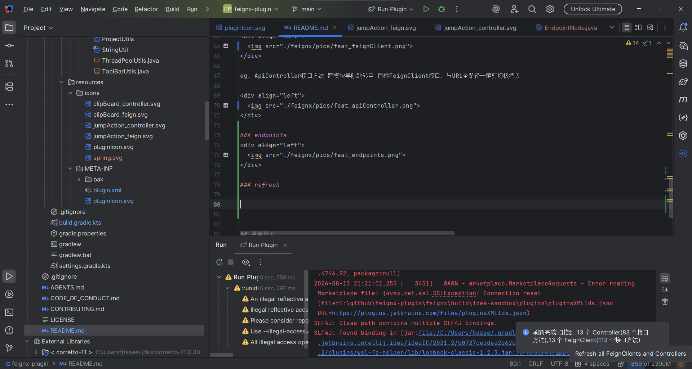

  
  
  
  <h2>FeignClient Assistant With RequestX</h2>

## 贡献者名单
Respect!

我们欢迎各位的宝贵意见(^^ゞ)

**诚邀广大开发者朋友们的Pull Request，让我们一起完善FeignClient Assistant With RequestX(FeignX)插件**

最新版本插件请及时关注IntelliJ IDEA插件市场更新FeignClient Assistant With RequestX

感谢朋友们的star⭐⭐

## 里程碑🎴

我们更名啦：FeignClient Assistant With RequestX

曾用名：[FeignX]/[Navigator4URL OpenFeign RestController]

已上架IntelliJ IDEA插件市场：https://plugins.jetbrains.com/plugin/25604-feignclient-assistant
- 2025/03/12 官方市场用户下载量突破5000
- 2025/03/20 官方市场用户下载量突破6000
- 2025/03/26 官方市场用户下载量突破7000
- 2025/04/17 官方市场用户下载量突破1W！新的里程碑
- 

## 使用教程
IntelliJ IDEA内Settings->plugins->Marketplace->搜索FeignClient Assistant With RequestX下载安装

---

  
  
Marketplace

中文说明：

FeignClient Assistant With RequestX是一个免费的SpringCloud FeignClient与远程SpringBoot ApiController之间的代码导航助手。

曾用名：[FeignX]/[Navigator4URL OpenFeign RestController]

1. 受MybatisX和方法级导航槽`Bird`的启发，您可以灵活并且跨模块的在`FeignClient`客户端和远程服务`ApiController`之间来回跳转。
2. FeignClient Assistant With RequestX支持`yml/yaml/properties`属性解析，如`server.servlet.context-path`和`spring.mvc.servlet.path`
3. FeignClient Assistant With RequestX精确定位目标接口，在多目标接口场景下，`FeignClient Assistant With RequestX`给用户提供多选项
4. FeignClient Assistant With RequestX支持实时动态解析目标接口，无需手动刷新缓存
5. FeignClient Assistant With RequestX支持url全路径复制到剪贴板（包括`Feign`和`Controller`接口），以帮助Vim朋友。
6. FeignClient Assistant With RequestX提供右侧`FeignClient Assistant With RequestX Endpoints`端点侧边栏：以树形结构集中展示工程内全部SpringBoot启动类、SpringMVC与OpenFeign端点（按类型分组、图标区分），支持路径模糊搜索、`HttpType`/`EndpointType`分类过滤、刷新与全部展开/收起，双击可跳转源码。
7. FeignClient Assistant With RequestX支持在端点侧边栏中发送真实HTTP请求：选中请求节点自动生成可编辑的 IntelliJ HTTP Client 脚本（兼容`@RequestBody`/`@RequestParam`/`@PathVariable`），一键执行并展示响应，同时记录请求历史（保存到工程`.idea/feignx-history`目录，支持搜索过滤与一键回填）。

### feat navigation
eg. FeignClent接口方法 跨模块导航跳转至 目标ApiController接口，与URL全路径一键剪切板拷贝

  

eg. ApiController接口方法 跨模块导航跳转至 目标FeignClient接口，与URL全路径一键剪切板拷贝

  

### feat endpoints

  

### feat refresh

  

## 更新日志

更新日志：[updateLog.md](feignx/docs/updateLog.md)